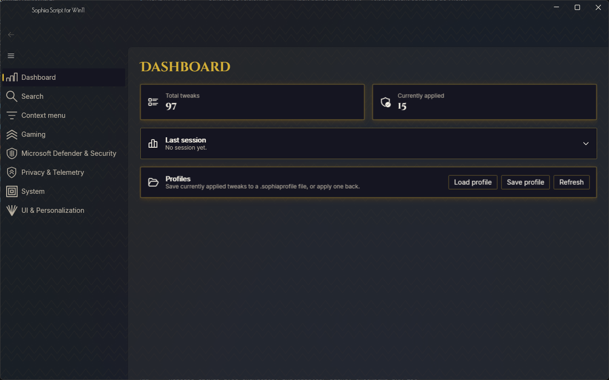
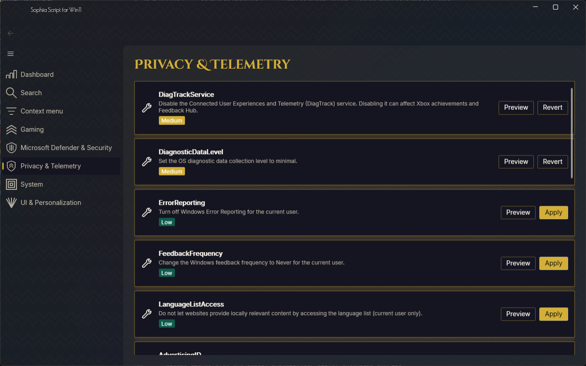

# Sophia Script for Win11

A native Windows 11 tweaking application in C# / WPF, reimplementing the full tweak catalog of [Sophia Script for Windows](https://github.com/farag2/Sophia-Script-for-Windows) with a graphical interface — no PowerShell console required.

Windows 11 only (25H2+ / Enterprise LTSC 2024). Offline-first: zero network dependency at runtime, every asset and runtime is embedded locally.

## Features

- **97 tweaks** across 6 categories — Privacy & Telemetry, UI & Personalization, System, Gaming, Microsoft Defender & Security, Context menu — each with a risk level, a one-click Apply/Revert, and a Preview button that shows exactly what will change before you commit to it.
- **Safety net on every apply**: conflicting tweaks are detected and blocked before anything runs, a Windows System Restore point is created automatically for medium/high-risk sessions, and a system health check runs before high-risk changes.
- **Profiles**: save your current set of applied tweaks to a portable `.sophiaprofile` file, and load it back on another machine.
- **Instant fuzzy search** across every tweak's name and description.
- **Art Déco theme** — a single, fixed visual identity (gold on deep black, custom iconography, animated transitions) rather than a generic system look.

More screenshots — the About tab and the guided-session view — will be added once those pages ship (see [Roadmap status](#status)).

## Installation

1. Download `SophiaWin11-Setup.exe` from the [latest release](https://github.com/Patrickjaillet/sophia-win11/releases/latest).
2. Run it and follow the installer. Administrator rights are required — the app applies changes at the registry and system-policy level.
3. Launch **Sophia Script for Win11** from the Start menu.

No separate .NET runtime install is needed — the installer bundles a self-contained build.

## Requirements

- Windows 11, build 25H2 or later, or Windows 11 Enterprise LTSC 2024
- Administrator rights (elevation is requested once at launch, not per tweak)

## Status

This is an actively developed project. `v1.0.0.0` is a feature-freeze release candidate covering the full tweak engine, the safety-net (conflict detection, restore points, health diagnostics), the complete UI shell, and the Art Déco theme/animation system. Localization, the About tab, guided sessions, and the signed installer are on the roadmap for upcoming versions.

## License

MIT — see [LICENSE](LICENSE).

Sophia Script — Copyright © 2026 Dmitry Nefedov ([original project](https://github.com/farag2/Sophia-Script-for-Windows))
UI for Windows 11 — Copyright © 2026 Patrick JAILLET
